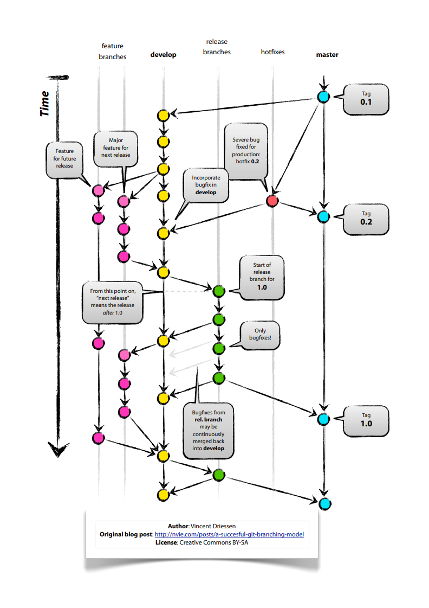

# Git 101 
Git-opas Haaga-Helian opiskelijoille.<br>
Auttaa alkuun Gitin käytön kanssa!

Sisällysluettelo
1. [Mikä on Git ja mihin sitä tarvitaan?](#1-mikä-git-on-ja-mihin-sitä-tarvitaan)
2. [Git:n asennus](#2-gitn-asennus)
3. [Komentorivin käyttö](#3-komentotulkin-käyttö)
4. [Git-komentoja](#4-yleisimpiä-git-komentoja)
5. [Repositoryn luonti omalle koneelle](#5ensimmäisen-repositoryn-luonti-omalle-koneelle)
6. [Miten viedä muutokset omasta repositorystä etärepositoryyn](#6-miten-viedä-muutokset-omasta-repositorystä-etärepositoryyn)
7. [Hiukan Githubista](#7-hiukan-githubista)
8. [Haarat ja miksi niitä tarvitaan](#8-haarat-ja-miksi-niitä-tarvitaan)
9. [Merge conflict! Mitä tapahtui, mitä teen?](#9-merge-conflict-mitä-tapahtui-mitä-teen)
10. [Muita huomoita](#10-muita-huomioita)
11. [Commit-viesteistä](#11-commit-viesteistä)
12. [Mikä ihmeen Github?](#12-mikä-ihmeen-Github)
13. [SSH-avaimen generointi](#13-ssh-keygen)
14. [Github Students-pack](#14-Github-Students-pack)
15. [Lisää Git-hosting-palveluista](#15-Lisää-Git-hosting-palveluista)
16. [Muita hyödyllisiä linkkejä](#16-Muita-hyödyllisiä-linkkejä)

### 1. Mikä Git on ja mihin sitä tarvitaan?
Git on versionhallintajärjestelmä. Versionhallinnalla tarkoitetaan palvelua, joka säilyttää koodia, eli toisin sanoen varmuuskopioi sitä. Versionhallinnan avulla voidaan muutosten tekemisen jälkeenkin palata aiempiin versioihin, jos esim. jotain menee pieleen. Koodin lisäksi versionhallinnan avulla tehdyt muutokset on helppo dokumentoida. Git on ilmainen ja hajautettu, eli siinä ei ole minkäänlaista keskitettyä palvelinta. Jokainen Git-tietovarasto on itsenäinen.

#### 1.1 Git:in historia
Git:in on kehittänyt suomalais-amerikkalainen ohjelmistoinsinööri Linus Torvalds, joka tunnetaan myös Linux kernelin kehittämisestä. Hän kehitti Git:in Linux kernelin versiohallintaa varten. Git julkaistiin ensimmäisen kerran 7. huhtikuuta 2005. Viimeisin vakaa versio Git:istä julkaistiin 17. helmikuuta 2020.

### 2. Git:n asennus
Git:n käyttämiseksi Git-ohjelmiston on oltava asennettuna tietokoneella, jolla sitä halutaan käyttää. Git-ohjelmiston asentamiseen löytyy useita eri ohjeita. Alla Git:n omat ohjeet.

[Git lataus](https://git-scm.com/downloads)<br>
[Git asennusohjeet](https://git-scm.com/book/en/v2/Getting-Started-Installing-Git)

#### 2.1 Konfigurointi
Jotta Git:in käyttö olisi mahdollisimman helppoa ja tehokasta, se kannattaa konfiguroida käyttämään tietynlaisia asetuksia ja työkaluja. Konfiguroinnin avulla Git saadaan toimimaan sillä tavalla kuin itse, tai projektitiimi haluaa.

Konfigurointikomentoja löytyy lukusia, jotka kaikki löytyy komennolla:

- `git config`

##### 2.1.1 Käyttäjätiedot
Jokaiseen versionhallintaan talletettavaan muutokseen tallennetaan sen tehneen käyttäjän nimi ja sähköpostiosoite. Git-ohjelmiston asentamisen jälkeen olisikin hyvä asettaa käyttäjätiedot komennoilla:

- `git config --global user.name "<username>"`
- `git config --global user.email "<email>"`

`<username>` ja `<email>` kohdat korvataan omalla nimellä ja sähköpostilla. Käyttäjätiedot tarvitsee asettaa vain kerran tietokoneelle. --global -tarkentimella tiedot asetetaan siten, että asetukset ovat tietokoneen käyttäjäkohtaiset. Halutessaan voi myös tallentaa käyttäjätietoihin tässä oletus-editorin konfliktien ratkomista varten. Tätä komentoa käyttäen editori avautuu automaattisesti, kun mergessä on konflikti:

- `git config --global core.editor "<editor> --wait"`

##### 2.1.2 Tekstieditori
Git-ohjelmistoa käyttäessä tulee esiin tilanteita, joissa on tarve käyttää tekstieditoria. Ohjelmiston asentamisen jälkeen oletusarvoinen tekstieditori on [Vi](https://fi.wikipedia.org/wiki/Vi). Vi:n käyttäminen voi tuntua haastavalta (ohjeita tosin löytyy esim [täältä](https://fi.wikipedia.org/wiki/Vi#Peruskomennot)), joten Git-ohjelmistossa on mahdollista vaihtaa tekstieditoria komennolla:
- `git config --global core.editor "<editor-and-options>"`

Tekstieditoriksi voi yrittää asettaa varmaan minkä tahansa ohjelman. Perusteelliset ohjeet eri editorien asettamiseksi löytyy [täältä](https://git-scm.com/book/tr/v2/Appendix-C%3A-Git-Commands-Setup-and-Config#_core_editor).

### 3. Komentorivin käyttö
Käyttöliittymä on tapa kommunikoida tietokoneen kanssa. Nykyään suurin osa ihmisistä on tottunut graafiseen käyttöliittymään, jossa tietokoneen kansioihin siirrytään kaksoisklikkaamalla kansion kuvaketta, ohjelmat suoritetaan klikkaamalla ohjelman kuvaketta ja niin edelleen.

__Komentorivi__, __komentoliittymä__ tai __terminaali__ (englanniksi command line tai terminal) on tekstikäyttöliitymä. Teksikäyttöliittymässä kansioiden välillä siirtyminen, ohjelmien suorittaminen jne tapahtuu kirjoittamalla komentoja ja antamalla näppäinyhdistelmiä.

Komentoliittymässä ajetaan tyypillisesti __komentotulkkia__. Käyttäjä kirjoittaa komentoliittymään (ts komentoriville tai terminaaliin) käynnistettävän ohjelman nimen tai komentotulkin sisäisen komennon mahdollisine parametreineen ja painaa syöttöpainiketta, jolloin komentotulkki käsittelee käskyn ja tulostaa vastineen näytölle (tai suorittaa ohjelman).

Komentotulkkeja on [useita](https://en.wikipedia.org/wiki/List_of_command-line_interpreters) ja on tärkeää huomata, etteivät kaikki komennot toimi kaikissa tulkeissa. Ehkä tärkeintä on tietää, että Unixin kaltaisissa käyttöjärjestelmissä (Linux, Mac) on eri oletus-tulkki kuin Windows-käyttöjärjestelmissä.

[git for windows](https://gitforwindows.org/) asennuksen yhteydessä asennetaan Bash-emulaattori, jossa käytetään Unix-shell -komentoja. Tämä siis mahdollistaa bash-komentojen käyttämisen myös Windows-käyttöjärjestelmissä.
>HUOM! Kaikki bash komennot ei toimi Git Bashissa

Yksinkertaisuuden vuoksi, tässä oppassa tullaan keskittymään nimen omaan bash-komentoihin ja kaikki esitellyt komennot toimivat myös Git Bashissa. Git-komentoja ei käsitellä tässä luvussa, ne löytyvät [luvusta 4](#4-yleisimpiä-git-komentoja)

#### 3.1 Komentorivin käynnistäminen
Jos tietokoneeseen on asennettu git for windows, Git Bash:n saa avattua klikkaamalla missä tahansa hakemistossa (kansio) hiiren oikealla näppäimellä ja valitsemalla `Git Bash Here`. Klikkaus käynnistää komentoliittymän, jonka __työhakemisto__ (tästä myöhemmin lisää) on se hakemisto, johon hiiren oikealla näppäimellä klikattiin.

MacOS tietokoneessa `terminal` löytyy Finderistä:
> Applications>Utility>Terminal

tai painamalla `cmd + space` (avaa Spotlight Search) ja kirjoittamalla `terminal`.

Ubuntussa (ja ilmeisesti useissa muissa Linux-käyttöjärjestelmissä) komentorivin saa auki painamalla `CTRL + ALT + T`.

>HUOM! Jos käyttää Visual Studio Code-ohjelmaa, on hyvä tietää, että siitä löytyy integroitu terminaali. Terminaalin saa näkyviin kirjoittamalla Command Palette:en (aukeaa painamalla `F1`) terminal ja valitsemalla `View: Toggle Integrated Terminal`.  
Integroidusta terminaalista tulee tarkastaa, mikä __komentotulkki__ on käytössä.

Komentorivi näyttää käynnistymisen jälkeen Git-Bashissä seuraavalta:
```
<tietokoneen-nimi>@<käyttäjä> MINGW64 ~<hakemisto>
$
```
ja terminal MacOS:ssä seuraavalta:
```
<tietokoneen-nimi>:<hakemisto> <käyttäjä>$
```
Vaikka erojakin on, on hyvä huomata, että molemmista löytyy lähes sama informaatio, ehkä tärkeimpänä `<hakemisto>`, jolla tarkoitetaan nykyistä työhakemistoa (tästä lisää myöhemmin). Jos `<hakemisto>`n tilalla on pelkkä `~` -merkki tarkoittaa tämä, että nykyinen hakemisto on käyttäjän oletushakemisto (kotihakemisto).

>HUOM! Molemmissa komentoriveissä viimeinen merkki on `$`. Tätä ei siis tarvitse itse kirjoittaa komentoriville, vaikka se saattaa jossain ohjeissa olla kirjoitettu ennen annettavaa komentoa

#### 3.2 Työhakemisto
On tärkeää ymmärtää, että komentorivia käyttäessä työskennellään aina jossain työhakemistossa (ts working directory tai kansio). Kaikki annetut komennot suoritetaan tässä työhakemistossa ellei toisin komenneta.

Esimerkiksi komennon `git init` suorittaminen luo paikallisen tyhjän repositorion sen hetkiseen työhakemistoon.

Työhakemistoa ei tule sekoittaa __kotihakemistoon__. Kotihakemisto on hakemisto, jossa oletusarvoisesti sijaitsee käyttäjän asetustiedostot ja muut omat tiedostot. Kotihakemistoa kuvataan komentorivillä (myös Git Bash) usein merkillä `~`.

#### 3.3 Komennot
Komennot annetaan komentoriville muodossa:
```
command param1 param2 param3 … paramN
```
jossa:
- `command` = annettava komento
- `param 1`, `param2` jne = komennon vaihtoehdot (options) ja argumentit

Komennon vaihtoehtoina (options) voidaan esimerkiksi antaa tarkennuksia, miten komento suoritetaan ja argumentteina esimerkiksi mille tiedostolle komento suoritetaan.

Komentorivin komentojen käyttö ei välttämättä vaadi suurta järjestelmän tuntemusta, sillä komennot ovat usein lyhennyksiä selväkielisistä englanninkielisistä sanoista, ja niille on yleensä saatavilla käytönaikainen ohje komennoilla `help` tai `man`.

>HUOM! `man` komennolla avataan parametrina annettavan komennon `man`-sivu, josta pääsee pois painamalla `q`

Esimerkki: Haluan käyttää komentoa `cd`, jolla siirrytään työhakemistosta toiseen, mutta en ole täysin varma, miten komentoa käytetään. Kirjoitan siis komentoriville
```
help cd
```
ja painan entteriä. Komentotulkki suorittaa tällöin komennon `help` parametrilla `cd` ja tulostaa jotain seuraavan laista:
```
cd: cd [-L|-P] [dir]
    <Hirveä määrä tekstiä>
    ...
    <Ja vielä usella rivillä :( >
```
Tulostuksen ensimmäisellä rivillä on ns 'synopsis' komennon käytöstä. Toisin sanoen siinä lukee, mitä optioita ja mitä argumentteina voi antaa komennon parametreina. <Hirveässä määrässä tekstiä> taas kerrotaan, mitä mikäkin parametri tekee.

>HUOM! Kaikille komennoille ei löydy `help` komennolla apua, eikä Git Bash tue `man` -komentoa, mutta ongelmatilanteissa kannattaa kokeilla helpin antamista komennon ___parameterina___ (ei siis komentona). Esimerkiksi `help ls` komennon antaminen ei tulosta neuvoja, mutta `ls --help` tulostaa.

>HUOM2! Toinen vaihtoehto on etsiä esimerkiksi googlesta `bash <komento> manual`


Komentorivin komennoista ja käytöstä löytyy lisää ohjeita internetistä, [ihan](http://appro.mit.jyu.fi/itkp1011/luennot/cli/) [suomeksikin](http://users.jyu.fi/~nieminen/ohj1/materiaalia/tyokaluohjeet/komentorivi_selviytyminen.html).

[Tässä bash komentoja fiksusti kategorisoituna](https://courses.cs.washington.edu/courses/cse390a/14au/bash.html)

[Tässä bash manuaali](http://www.gnu.org/savannah-checkouts/gnu/bash/manual/bash.html)


##### 3.3.1 Yleisiä komentoja
Nykyisen työhakemiston saa selville komennolla
```
pwd
```
**p**rint **w**orking **d**irectory.

Työhakemistossa olevat tiedostot ja alihakemistot saa selville suorittamalla komennon
```
ls
```
`ls` -komennon voi suorittaa myös esimerkiksi vaihtoehdolla (option) `-a`, jolloin listataan myös tiedostot ja kansiot, jotka alkavat `.` merkillä ('piilotetut tiedostot/kansiot').

Esimerkiksi `git init` -komennolla luodaan `.git` hakemisto, joka ei näy pelkällä `ls` -komennolla, mutta näkyy suorittamalla `ls -a`.

Komentoa voi myös käyttää antamalla sille argumenttina hakemisto, jonka tiedostot halutaan listata. Esimerkiksi suorittamalla `ls -a /c` -komento, saadaan listattua __kaikki__ tiedosto ja hakemistot, jotka sijaitsevat `/c` -hakemistossa (ts c-asema).

Nykyistä työhakemistoa vaihdetaan komennolla
```
cd
```
**c**hange **d**irectory

>HUOM! Ilman argumentteja annettaessa komennon suorittaminen vaihtaa työhakemistoksi käyttäjän kotihakemiston.

Yleensä komennolle kuitenkin annetaan argumenttina se hakemisto, jonka halutaan olevan uusi työhakemisto. Argumentin hakemisto voidaan antaa joko täydellisenä polkuna (absolute path) tai suhteellisena polkuna (relative path). Esimerkiksi, jos työhakemistoksi halutaan vaihtaa `C:\Users\Git-user\Documents`, voidaan käyttää ___mistä tahansa___ työhakemistosta komentoa: `cd /C/Users/Git-user/Documents` TAI jos nykyinen työhakemisto on `C:\Users\Git-user` antamalla komento: `cd Documents`.

### 4. Yleisimpiä git-komentoja

- `git config --global user.name <username>` - Asettaa käyttäjälle nimen, joka näkyy käyttäjän tekemissä commiteissa.

- `git config --global user.email <email>` - Asettaa käyttäjälle sähköpostin, joka näkyy käyttäjän tekemissä commiteissa.

- `git init` - Luo paikallisen tyhjän repositoryn

- `git add .` - Vertaa hakemistoa local repoon ja siirtää kaikki muutokset tilaan staged, eli nyt ne ovat valmiita commitoitavaksi local repoon. Koskee myös tiedoston luomisia ja poistamisia.

- `git commit` - Tallettaa staged tilassa olevat tiedostot local repositoryyn.

- `git commit --amend` - Tällä voit lisätä edelliseen committiin muutoksia, jotka unohdit tehdä (ennen sitä stageta muutokset normaalisti git add:lla).

- `git status` - Näyttää staged tilassa olevat tiedostot.

- `git diff` - Näyttää erot tiedostojen työtila versioissa verrattuna local repossa oleviin versioihin. Eli näyttää muutokset, joita ei ole commitettu.

- `git reset` - Tyhjentää tiedostot staged tilasta, eli jos olet tehnyt git add jonkun tiedoston niin git reset poistaa sen tiedoston staged tilasta.

- `git rm <file name>` - Poistaa tiedoston ja asettaa tiedoston poiston staged-tilaan, jonka jälkeen tiedoston poisto voidaan commitoida (jos halutaan poistaa kansio, käytetään laajenninta -r, eli `git rm -r <folder name>`).

- `git checkout` - Poistaa muutokset työtilan versiosta ja palautuu local repossa olevan tuoreimman version mukaiseksi.

- `git checkout <branch name>` - Vaihtaa työtilan nimettyyn haaraan.

- `git revert <commit>` - Jos olet jo commitoinut muutokset ja haluatkin palata takaisin aikaisempaan tilaan.

- `git branch testing` - Luo uuden testing-nimisen haaran.

- `git checkout -b <branch name>` - Luo uuden haaran ja vaihtaa työtilan tähän uuteen haaraan.

- `git fetch <nameOfTheRemoteRepo>` - Lataa remote repositoryn tiedot paikalliseen repositoryyn, mutta ei muuta paikallista repoa.

- `git pull <remotenNimi>` - Hakee nykyisen haaran tiedot etä-reposta ja tekee mergen automaattisesti.

- `git merge <branch name>` - Yhdistää nimetyn haaran muutokset työtilaan.

- `git push` - Tallentaa omat lokaalit muutokset etärepositoryyn. Push-komennosta lisää kohdassa 7.

- `git --help` - Listaa hyödyllisimmät git komennot.

- `git clone <repository-url>` - Kloonaa etärepositoryn paikalliseen repositoryyn.

### 4.1 Muita git komentoja

- `git merge no -ff` - Pakoittaa mergeen kommitin välittämättä siitä onko siihen tullut mitään muutoksia. Tämän avulla haaran olemassaolo tallentuu historiaan vaikka se myöhemmin poistettaisiinkin.

- `git stash` - Piiloittaa haaran missä olet. Voit palauttaa haaran komennolla `git stash apply` (Huom! Kannattaa tehdä vain yksi stash, useimpien stash:en käytöstä voi aiheutua päänvaivaa) Komennolla `git stash drop` voit poistaa kyseisen stash:n.

- `git clean` - Poistaa kaikki untracked-tiedostot, joita ei ole mainittu .gitignore tiedostossa.

- `git tag -a "kommitin_nimi" -m "viestisi"` - Voit kirjata muistiin ns. "leiman" tiettyyn kommittiin. Tämä on hyödyllistä esimerkiksi versioinnin merkinnöissä.

### 5. Ensimmäisen repositoryn luonti omalle koneelle

Avaa Bash-komentokehote kansiossa, josta haluat tehdä repositoryn tai siirry oikeaan kansioon komennolla
`cd <kansio>`

Voit myös luoda Bashin kautta kansion johon haluat reposirotyn tehdä komennoilla `mkdir <kansion nimi>` jonka jälkeen siirtyä kansioon komennolla `cd <kansio>`

Anna sitten seuraavat komennot:
1. `git init`
2. `git add .`
3. `git commit -m 'Ensimmäinen commit'`

<<<<<<< HEAD
#### 5.1 Olemassa olevan repositoryn kloonaaminen omalle koneelle

Useasti projektien etä-repository on keskitetty yhteen paikkaan, jolloin yleisin tapa saada repository myös omalle paikalliselle koneelle on kloonata se. Kuten paikallisen repositoryn luominen, myös kloonaaminen on kertaluonteinen tapahtuma. Kloonattu repository tuodaan paikalliseen koneeseen aina kansion sisällä, jolloin sille ei tarvitse välttämättä luoda oma kansiotaan.

Helpoin tapa kloonata etä-repository on painaa projektin GitHub-sivulla vihreää nappia "clone or download" ja kopioda siinä annettu URL. Tämän jälkeen avaa Git Bash ja anna komento:

`git clone <repo url>`

##### 5.1.1 Repositoryn kloonaaminen omalle koneelle käyttäen SSH protokollaa

Jossain tapauksissa etä-repository vaatii SSH-avainta suorittaakseen kloonauksen onnistuneesti. Git kuitenkin onneksi tukee muutamia verkkoprotokollia, kuten SSH protokollaa, jonka avulla tiedot voidaan antaa yhdessä komennossa. [Luvusta 11](#11-ssh-avain) löydät enemmän tietoa SSH-protokollasta ja miksi sitä käytetään.

Etä-repositoryn kloonaaminen käyttäen SSH protokollaa tapahtuu hieman eri tavalla kuin yllä mainitussa komennossa. Komennossa käyttäjän täytyy antaa GitHub-URL:in sijasta SSH URL, jolloin komento on mallia:

`git@HOSTNAME:USERNAME/REPOSITORYNAME.git`


### 6. Miten viedä muutokset omasta repositorystä etärepositoryyn

1. `git remote add origin https://github.com/user/example.git`
2. `git push origin master`
- komento vie paikallisen master-haaran origin-repoon (origin on etärepositoryn oletusnimi)
TAI  
`git push --all`
 jolloin kaikki paikalliset haarat viedään.
Jos ensimmäisellä kerralla käytät laajenninta -u (=--set-upstream) haaran etärepository on asetettu oletukseksi ja komennoksi riittää pelkkä
`git push`


### 7. Hiukan Githubista
Git itsessään on vain komentorivillä toimiva ohjelma, joten sen käytön helpottamiseksi on kehitetty lukuisia eri graafisia käyttöliittymiä.
Niistä Github on ainakin tällä hetkellä käytetyin, ja omien raporttiensa mukaan se on virallisesti "maailman suurin lähdekoodi-verkkopalvelu".
Kun siis puhutaan Gitin käytössä etärepositoreista, niin niillä tarkoitetaan Githubissa (tai Githubin kaltaisessa palvelussa) säilytettävää ohjelmakoodia. Githubilla on kuitenkin nykyään myös muita palveluita, esimerkiksi erilaisia työkaluja projektinhallinnan helpottamiseksi.

### 8. Haarat ja miksi niitä tarvitaan
Haarat `branch` ovat mainio keino pitää saman projektikokonaisuuden eri kehityisvaiheita erillään toisistaan kuitenkin pitäen ne samassa repositoryssä. Yleisimpiä haarakehyksiä ja haarojen käyttöä erilaisissa projekteissa löytyy [tästä linkistä](https://nvie.com/posts/a-successful-git-branching-model/).

Haarojen tarkoitusperä on siis pitää esimerkiksi kehityksessä olevan sovelluksen valmiit testatut osat master haarassa ja toteuttaa testausta sekä jatkokehitystä esimerkiksi development haarassa. Lisäksi voidaan hyvin käyttää omia haaroja ei niin tärkeille komponenteille tai ideoille.
Tällä tavoin ohjelmistokehittäjä voi turvata ettei mikään erillinen osuus projektissa vaikuta mihinkään muuhun, ennenkuin hän näin päättää ja yhdistää `merge` haaran masteriin.

Ennen kuin siirryt haaroista toiseen, muista aina commitoida muutoksesi! Staging-alue ei ole riippuvainen mistään haarasta, joten jos jätät staging-alueella olevat muutokset committoimatta ja vaihdat haaraa, nämä samat muutokset säilyvät staging-alueella. Muutokset siirtyvät haaraan vasta commit-komennon jälkeen.

Yleisesti ottaen masterissa ei koodata mitään, ja se toimiikin vain loppusijaintina täydelliselle koodille, jota ei tulla enää muuttamaan.

[Luvusta 4](#4-yleisimpiä-git-komentoja) löydät erilaisia git-komentoja, joilla luoda haaroja, navigoida eri haarojen välillä sekä yhdistää haaroja.

#### 8.1 Hyvä haaroitusmalli
Hyvässä haaroituksessa master haarassa julkaistaan vain valmiita versioita. Develop haarassa on kaikki valmiit muutokset, mitä seuraavaan julkaisuun ollaan lisäämässä. Kaikki kehitys tapahtuu feature haaroissa, joista valmiit ominaisuudet lisätään develop haaraan. Kun develop haara on vakaa se voidaan yhdistää master haaraan, ja silloin tulee uusi versio ohjelmasta, mikä kuuluu tagata.



### 9. Merge conflict! Mitä tapahtui, mitä teen?
Merge conflicteja tapahtuu silloin kun yhdistettävissä haaroissa on keskenään ristiriitaisia muutoksia ja git ei tiedä, mitkä niistä tulisi sisällyttää committiin.

 Tällöin on käsin ratkaistava konfliktit ja valittava pidettävät koodit. Git ilmoittaa, missä kansiossa konflikti on tapahtunut ja toisensa poissulkevat commitit on eroteltu tiedostossa:
 - `<<<<<<` kertoo,mistä konflikti alkaa
 - `======` erottaa muutokset haarojen välillä
 - `>>>>>>` ilmoittaa, milloin konflikti loppuu

 Tarkista kumpi otetaan käyttöön, jonka jälkeen poista konflikti merkit, tallenna tiedostot ja commitoi koodi. Lisää tietoa merge konfliktien korjaamiseen löytyy [täältä] (https://www.atlassian.com/git/tutorials/using-branches/merge-conflicts)

### 10. Muita huomioita
- `.gitignore` - on tiedosto, jossa voidaan määritellä etärepositoriosta pois jätettävät tiedostot. Gitignore tiedostoa hyödyntämällä voimme jättää tarpeettomat ja mahdollisesti arkaluontoiset tiedot (salasanat tai muut kehityksessä tarvittavat tiedot) pois etärepositoriosta.Yleissääntönä pois jätetään:
- tiedostot, joita projektin kehityksessä ei tarvita
- generoidut tiedostot
- paketinhallinnan lataamat tiedostot (esim node-modules)
- henkilökohtaiset konfiguraatiot

Valmiita .gitignore malleja löytyy [tästä linkistä](https://github.com/github/gitignore)

- `git config` - voidaan antaa gitille uusia asetuksia
- `git config --global --list` listaa käytössä olevat globaalit asetukset

Esim.
- `git config --global core.autocrlf false` Kertoo gitille, että ei muuta rivinvaihtoja kun tehdään commit. Hyödyllistä, jos projektia on kehittämässä henkilöitä, joilla on eri käyttöjärjestelmiä. Käyttöjärjestelmät rivittävät tiedostoja eri tavoin.

### 11. Commit-viesteistä

Commit-viestin tarkoituksena on kommentoida, miksi jokin muutos on tehty ja mitä sillä on tarkoitus saada aikaan. Hyvin laaditut commit-viestit ovat arvokasta informaatiota muille kehitystiimin jäsenille ja myöskin kehittäjälle itselleen, jos pitää jäljittää jälkeenpäin, miksi on päädytty tietynlaisiin ratkaisuihin tai muutoksiin. Jotta `git log` -tulosteen seuraaminen olisi helpompaa, olisi hyvä, että viestit on laadittu systemaattisesti tietyn käytännön mukaisesti, jota kaikki kehitystiimin jäsenet noudattavat.

Committiin tulevien muutosten tulisi muodostaa looginen kokonaisuus, josta on helppo kirjoittaa kuvaava viesti. Selkeästi koostetut commitit helpottavat muutosten perumista tai lisäämistä muiden työhön. Commit-viestien käytännöistä kannattaa sopia projektin alussa kaikkien tiimiläisten kesken.

#### Hyvän commit-viestin säännöt:
- Otsikko alkaa isolla alkukirjaimella ja se on korkeintaan 50 merkkiä pitkä
- Otsikkoviestien verbit ovat samassa aikamuodossa (esim. imperatiivi)
- Jos on tarpeen antaa yksityiskohtaisempi selvitys muutoksista, se erotetaan otsikkorivistä tyhjällä rivillä, ja tekstin pituus on enintään 72 merkkiä

[Esimerkki hyvästä commit-viestistä](https://tbaggery.com/2008/04/19/a-note-about-git-commit-messages.html)


### 12. Mikä ihmeen Github?

GitHub on verkkosivusto, joka tarjoaa paikan Git-versionhallintaa käyttäville ohjelmakehitysprojekteille. Git itsessään on komentoriviohjelma, jolle Github tarjoaa erään graafisen käyttöliittymän. Gitin lisäksi GitHub tarjoaa projekteille toimintoja kuten bugienseurannan, kehitystoiveet, tehtävien hallinta ja wiki.

Git-versionhallintaa toteutetaan siis paikallisesti, mutta viemällä projektin Githubiin tai vastaavaan palveluun saadaan toteutettua Gitillä etärepository, jonka voi halutessa jakaa muiden käytttöön.

Huhtikuun 2016 GitHubin raportin mukaan sillä oli yli 14 miljoonaa käyttäjää ja yli 35 miljoonaa ohjelmavarastoa. Tämä tekee siitä maailman suurimman lähdekoodi-verkkopalvelun.

[Tutustu Githubiin](https://github.com/)


### 13. SSH-avaimen generointi

SSH-protokollan avulla voit muodostaa yhteyden etäpalvelimiin ja palveluihin ja todentaa ne. SSH-avaimet ovat tapa tunnistaa luotettavat tietokoneet ilman salasanoja.  Jotta kirjautuminen onnistuisi, tarvitsee ensin luoda julkinen (public) ja salainen (private) avain. Sitten julkinen avain kopioidaan kohdekoneelle.

`ssh-keygen` -komennolla voit luoda avainparin. Komennon jälkeen varmennetaan tiedostojen tallennuspaikka sekä sen jälkeen sille voi määritellä salasanan.

### 14. Github Students-pack

Github tarjoaa opiskelijoille Students-packin ilmaiseksi. Students-pack sisältää useita kehittämistyökaluja opiskelijoille. Esimerkiksi opiskelijan paketista löytyy DigitalOcean, joka tarjoaa palvelimia. Opiskelijan paketti tarjoaa $50 credittiä uusille käyttäjille. Opiskelijan paketista löytyy myös useita ilmaisia kursseja.

Liittyminen on helppoa. Omaan github-käyttäjään pitää liittää oppilaitoksen sähköposti. Liittyminen onnistuu helposti täältä:
[Github Students-pack](https://education.github.com/pack)

### 15. Lisää Git-hosting-palveluista

GitHub ei ole ainoa etärepositoriovaihtoehto. Muistetaan, että Git on teknologia, joka mahdollistaa versionhallinnan ja että palvelut, kuten GitHub tai GitLab hyödyntävät Git teknologiaa. Voimme valita mieltymystemme mukaan tarpeeseen sopivan palveluntarjoajan. Sama asia voidaan toteuttaa molemmissa palveluissa ja eri palveluntarjoajat tarjoavat hieman erilaisia toiminnallisuuksia. 

Suosituimmat Git hosting-palveluntarjojat
- GitHub
- Bitbucket
- GitLab

[Linkki videoon, jossa vertaillaan GitHubia ja GitLabia](https://www.youtube.com/watch?v=s8DCpG1PeaU)

### 16. Muita hyödyllisiä linkkejä

[Gitin perusteet 50 minuutissa](https://www.youtube.com/watch?v=U8GBXvdmHT4)<br>
[GitHubin YouTube kanava](https://www.youtube.com/githubguides)<br>
[Git Handbook](https://guides.github.com/introduction/git-handbook/)<br>
[Git Cheat sheet](https://github.github.com/training-kit/downloads/github-git-cheat-sheet/)<br>
[Resourses to learn Git](https://try.github.io/)<br>
[Git 101, with Exercises](https://gist.github.com/peterhurford/4d43aa5d6de114c0c741ba664c9c5ff5)<br>
[Git Exercise](https://gitexercises.fracz.com/)<br>
